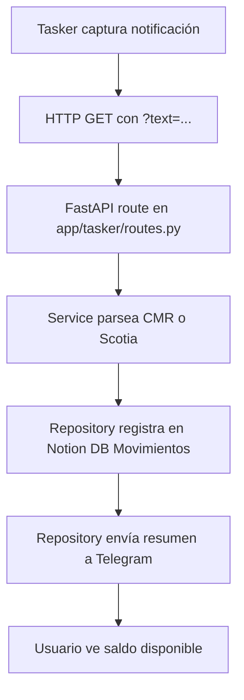

# Request Flow

```
Tasker (Android) → HTTP GET → FastAPI route → Service parses notification
→ Repository (Notion API) → Repository (Telegram API) → User
```



## Layers

- **`routes.py`** — recibe la petición HTTP, extrae query params, retorna respuestas.
- **`schemas.py`** — modelos Pydantic para validación y documentación OpenAPI.
- **`service.py`** — lógica de aplicación: parseo de notificaciones, inferencia de categorías, cálculo de presupuesto.
- **`repository.py`** — integraciones externas: API de Notion (gastos y periodos), API de Telegram (mensajes).
- **`config.py`** — variables de entorno centralizadas.
